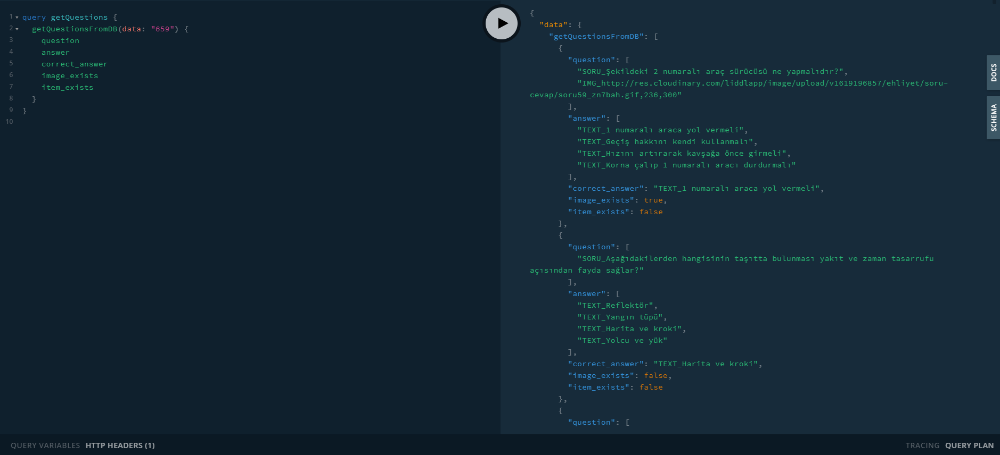

# Liddl - Çıkmış Ehliyet Sınav Soruları

### Stack: NodeJS, GraphQL, MongoDB, ReactJS ve React Native 🚀

### React Native öğrenirken geliştirdiğim 3. uygulama. (android)

### Google Play Store

#### https://play.google.com/store/apps/details?id=com.liddlapp.ehliyet

## Screenshot - Mobile

## Screenshot - Web Panel

## Screenshot - Server GraphQL API

